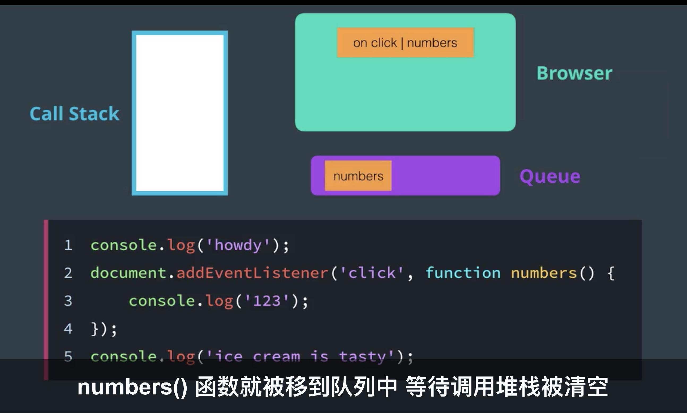

iterator protocal:
Symbols
for . of .

google devtools
$0: 获得当前选择的dom
$_: 获得上次计算的变量

web APIS: https://developer.mozilla.org/en-US/docs/Web/API

.querySelector()
.querySelectorAll()

const nanodegreeCard = document.querySelector('.card');
console.dir(nanodegreeCard);  这个类似python的dir(), 可以查看对象有哪些属性和方法

myElement.textContent = 'The <strong>Greatest</strong> Ice Cream Flavors'; // element都会都变成plain string显示出来
myElement.innerHTML = 'The <strong>Greatest</strong> Ice Cream Flavors';  // 会渲染element的格式
myElement.innerText: 受CSS的影响, 比如只取到非隐藏的text, 或大写等, 性能也慢, 尽量不用吧
myElement.textContent : 不受CSS的影响

.removeChild()
.remove()
.firstChild: 如果有空白, 会返回空白#text
.firstElementChild: 返回第一个元素
.parentElement

CSS的控制
.style.<prop>
.cssText()
.setAttribute()
.className
.classList: 尽量用这个

// Set multiple styles in a single statement
elt.style.cssText = "color: blue; border: 1px solid black"; 
// Or
elt.setAttribute("style", "color:red; border: 1px solid blue;");

// Set specific style while leaving other inline style values untouched
elt.style.color = "blue";

# 事件
google devtools https://developers.google.com/web/tools/chrome-devtools/console/events#monitor_events

监控点击事件
monitorEvents(document.body, "click");

获取注册在dom对象上的事件监听
getEventListeners(domObj);

捕捉与冒泡 phase

event.preventDefault();

Event Delegation: 1. 不用重复给每个子元素添加listener 2. 即使子元素开始不存在也没事

DOMContentLoaded:
 
document.addEventListener('DOMContentLoaded', (event) => {
    console.log('DOM fully loaded and parsed'); // 译者注："DOM完全加载以及解析"
});

'load'比DOMContentLoaded晚, 它会等图片加载后再触发

2者都是在document上触发的

# 性能篇
const myDocFrag = document.createDocumentFragment();
在DocumentFragment节点下的操作不会引发reflow和repaint

Reflow & Repaint
Reflow (计算)is the process of calculating the dimensions and position of page elements. This is a computationally intensive (slow) tasks. 
Repaint (绘制)is the process of drawing the pixels to the screen. This is faster than reflow, but is still not a fast process.

# call stack and Event Loop
call stack: js单线程, 一共一个stack, 就是个函数调用堆栈
event loop: 
两个原则:
 1. If some JavaScript is running, let it run until it is finished ("run-to-completion"). 
 2. If no JavaScript is running, run any pending event handlers.

    
    可以认为event handler存在Browser里面, 当有事件发生时, browser把对应事件处理函数放到event queue中, 等到当前的call stack变空(run to completion)后, 再把queue中事件处理函数放到call stack中跑.

    
